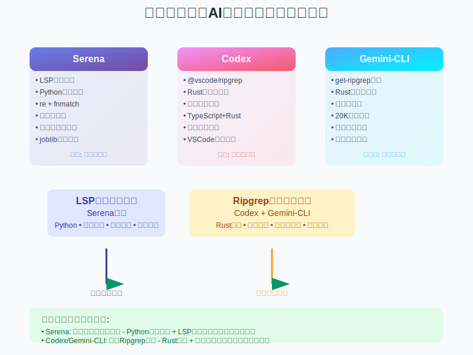
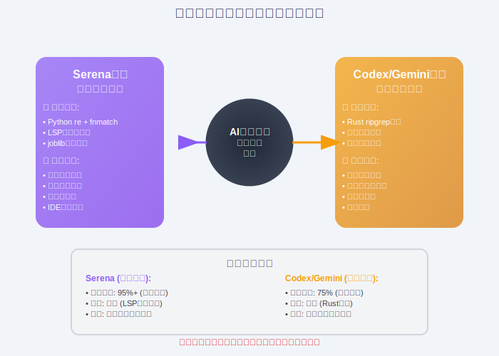

# AST Grep + LSP：四种代码搜索技术架构的深度对比

## 引言：从文本搜索到语义理解的跃迁

在AI编程工具的发展过程中，如何高效、精准地理解和搜索代码一直是核心挑战。传统的RAG（Retrieval-Augmented Generation）方案虽然在文本处理方面表现出色，但在代码理解的深度和精度上存在明显不足。本文通过深度分析四个前沿AI编程项目——Serena、Codex、Gemini-CLI和Claude Code，揭示AST（抽象语法树）grep结合LSP（Language Server Protocol）技术如何成为替代传统RAG的技术良方，并展现四种截然不同的技术演进路径。



## 核心技术架构对比

### Serena：语义驱动的LSP革命

Serena项目代表了AI编程工具在代码理解方面的技术突破，其核心优势体现在以下几个方面：

#### 1. LSP驱动的语义理解架构

Serena基于语言服务器协议（LSP）构建了完整的代码语义分析体系：

```python
# Serena核心：SolidLanguageServer 统一封装
class SolidLanguageServer:
    """
    统一的Language Server Protocol封装
    提供跨语言的符号级别操作能力
    """
    def find_symbol(self, name: str, symbol_type: Optional[str] = None):
        """基于LSP的精确符号搜索"""
        
    def find_referencing_symbols(self, location: Location):
        """查找符号引用关系"""
        
    def get_symbols_overview(self, file_path: str):
        """获取文件符号概览"""
```

这种架构的核心价值在于：

- **符号级精度**：不再依赖文本匹配，直接操作代码的语义单元
- **关系理解**：理解符号之间的引用、继承、实现等复杂关系
- **多语言统一**：支持Python、TypeScript、Go、Rust等20+编程语言

#### 2. Python内置搜索引擎

Serena采用了与众不同的搜索实现方式：

```python
# Serena的搜索实现 (src/serena/text_utils.py)
def search_files(
    relative_file_paths: list[str],
    pattern: str,
    root_path: str = "",
    file_reader: Callable[[str], str] = default_file_reader,
    context_lines_before: int = 0,
    context_lines_after: int = 0,
) -> list[MatchedConsecutiveLines]:
    """
    使用Python内置re模块进行搜索
    配合joblib实现并行文件处理
    """
    # 使用joblib并行处理文件
    results = Parallel(n_jobs=-1)(
        delayed(process_single_file)(path) 
        for path in filtered_paths
    )
```

**Serena的技术特点**：

- **Python内置**：使用`re`模块和`fnmatch`进行文本搜索
- **并行优化**：通过`joblib`实现多文件并行处理
- **语义优先**：文本搜索服务于LSP语义分析，精度优于性能

#### 3. 内存与知识持久化

Serena独特的记忆系统实现了项目知识的积累：

```markdown
# .serena/memories/项目架构理解.md
## 核心模块依赖关系
- SerenaAgent: 中央协调器，管理项目、工具和用户交互
- SolidLanguageServer: LSP统一接口，处理符号操作
- Tool System: 分类工具集，支持文件、符号、内存、配置操作
```

### Codex：Ripgrep性能优先方案

OpenAI的Codex项目采用了不同的技术路径，重点关注搜索性能和用户体验：

#### 1. Ripgrep高性能文本搜索

```json
{
  "dependencies": {
    "@vscode/ripgrep": "^1.15.14"
  }
}
```

Codex选择了`@vscode/ripgrep`作为核心搜索引擎，这是一个经过高度优化的Rust实现的文本搜索工具。其技术特点：

- **极致性能**：Rust实现，支持并行搜索和正则表达式优化
- **VSCode生态**：与主流IDE工具链深度集成
- **渐进增强**：在文本搜索基础上逐步添加语义功能

#### 2. 架构设计理念

Codex的架构体现了"性能第一"的设计理念：

```rust
// Codex核心模块架构（Rust实现）
// apply_patch.rs - 代码补丁应用
// exec.rs - 命令执行引擎  
// mcp_tool_call.rs - MCP工具调用
// project_doc.rs - 项目文档生成
```

- **混合语言优势**：TypeScript前端 + Rust后端，兼顾开发效率和运行性能
- **模块化设计**：各功能模块相对独立，降低耦合度
- **渐进式功能**：从基础文本搜索逐步扩展到语义理解

### Gemini-CLI：企业级Ripgrep优化

Google的Gemini-CLI项目在代码搜索方面采用了更加务实的工程化路径：

#### 1. 专业化Ripgrep集成

```typescript
// packages/core/src/tools/ripGrep.ts
export class RipGrepTool extends BaseDeclarativeTool {
  static readonly Name = 'search_file_content';
  
  private async performRipgrepSearch(options: {
    pattern: string;
    path: string;
    include?: string;
    signal: AbortSignal;
  }): Promise<GrepMatch[]> {
    // 企业级搜索优化实现
  }
}
```

#### 2. 工程化搜索特性

Gemini-CLI在代码搜索方面的工程化体现：

- **依赖管理**：`@joshua.litt/get-ripgrep` 自动下载和管理ripgrep二进制文件
- **结果限制**：默认20,000条匹配限制，防止性能问题
- **智能过滤**：自动排除`.git`、`node_modules`等无关目录
- **并发控制**：`--threads 4` 多线程搜索优化



## Claude Code：Agent工具编排的第四条路径

继前三个项目展现了不同的技术路径后，Claude Code作为Anthropic官方AI编程助手，开创了第四种技术架构：**Agent驱动的工具编排系统**。

### 独特的技术架构

Claude Code没有选择单一的搜索引擎优化，而是构建了一套完整的工具生态系统：

#### 1. 自研双搜索引擎架构

```javascript
// Claude Code的Glob实现 (FJ1内部标识)
async function* globSearchImplementation(params, context) {
  const walker = new FileSystemWalker({
    root: searchPath,
    maxDepth,
    ignorePatterns: ['node_modules/**', '.git/**']
  });
  
  // 高性能文件遍历 + 权限验证
  for await (const filePath of walker.walk()) {
    if (matchesPattern(filePath, params.pattern)) {
      yield createFileMatch(filePath);
    }
  }
}

// Claude Code的Grep实现 (XJ1内部标识)  
async function* grepSearchImplementation(params, context) {
  const regex = new RegExp(params.pattern);
  const searchPromises = [];
  const concurrencyLimit = 10;  // 并发控制
  
  // 并行内容搜索
  for await (const filePath of getFilesToSearch()) {
    if (searchPromises.length >= concurrencyLimit) {
      await Promise.race(searchPromises);
    }
    searchPromises.push(searchFileContent(filePath, regex));
  }
}
```

#### 2. Ripgrep集成策略

Claude Code采用了多层级的搜索策略：

1. **主要搜索**：自研Glob+Grep工具
2. **性能优化**：ripgrep作为后备引擎
3. **工具强制替代**：禁止使用传统grep/find命令

```javascript
// 工具替代强制机制
function checkToolSubstitution(command) {
  const substitutions = {
    'find': { tool: 'Glob', reason: '使用Glob工具进行文件查找' },
    'grep': { tool: 'Grep', reason: '使用Grep工具进行内容搜索' },
    'cat': { tool: 'Read', reason: '使用Read工具读取文件' }
  };
  
  if (substitutions[command]) {
    throw new ToolSubstitutionRequired(substitutions[command]);
  }
}
```

#### 3. Agent编排系统

Claude Code最大的创新在于Agent层面的工具编排：

```ascii
                Claude Code Agent 工具编排架构
    ┌─────────────────────────────────────────────────────────────────┐
    │                       nO主循环引擎                             │
    │              (异步生成器 + 智能任务分解)                        │
    └─────────────────────┬───────────────────────────────────────────┘
                          │
    ┌─────────────────────▼───────────────────────────────────────────┐
    │                  MH1工具执行引擎                               │
    │       ┌─────────┐ ┌─────────┐ ┌─────────┐ ┌─────────┐         │
    │       │  Glob   │ │  Grep   │ │  Read   │ │  Task   │         │
    │       │ (FJ1)   │ │ (XJ1)   │ │  工具   │ │ SubAgent│         │
    │       └─────────┘ └─────────┘ └─────────┘ └─────────┘         │
    │                          │                                     │
    │       ┌─────────────────▼─────────────────┐                   │
    │       │        UH1并发控制器                │                   │
    │       │      最大10并发 + 权限验证           │                   │
    │       └─────────────────────────────────────┘                   │
    └─────────────────────────────────────────────────────────────────┘
```

### Claude Code的核心优势

#### 1. 工具生态系统完整性

与其他三个项目专注于搜索性能不同，Claude Code构建了完整的工具链：

| 工具类别 | 具体工具 | 功能覆盖 |
|----------|----------|----------|
| **搜索发现** | Glob, Grep | 文件查找 + 内容搜索 |
| **文件操作** | Read, Write, Edit | 完整的文件生命周期 |
| **任务管理** | TodoWrite, Task | 复杂任务分解和追踪 |
| **系统执行** | Bash, WebFetch | 系统集成和网络能力 |

#### 2. Agent驱动的智能编排

```javascript
// Claude Code的智能任务分解示例
async function* intelligentTaskDecomposition(userRequest) {
  // 1. 任务复杂度分析
  const complexity = await analyzeTaskComplexity(userRequest);
  
  // 2. 工具链规划
  const toolChain = planToolExecution(complexity);
  
  // 3. 并发执行优化
  const concurrentTools = identifyConcurrentTools(toolChain);
  
  // 4. 动态工具调度
  for (const toolGroup of concurrentTools) {
    await Promise.all(toolGroup.map(tool => executeTool(tool)));
    yield createProgressUpdate(tool.name);
  }
}
```

#### 3. 多模态搜索能力

Claude Code不仅仅局限于代码搜索，还集成了：

- **Web搜索**：实时信息获取
- **文档处理**：PDF、图片、Jupyter notebook支持  
- **浏览器自动化**：通过Playwright进行Web交互
- **MCP集成**：第三方工具生态

## 技术深度对比分析

### 1. 四种搜索技术架构对比

| 项目 | 搜索引擎 | 技术实现 | 核心优势 | 架构路径 |
|------|----------|----------|----------|----------|
| **Serena** | Python内置 | re + fnmatch + LSP | 语义精确度 ⭐⭐⭐⭐⭐ | 语义理解优先 |
| **Codex** | @vscode/ripgrep | Rust引擎 | 搜索性能 ⭐⭐⭐⭐⭐ | 性能优化 |
| **Gemini-CLI** | @joshua.litt/get-ripgrep | Rust引擎 + 企业优化 | 工程化程度 ⭐⭐⭐⭐⭐ | 企业级性能 |
| **Claude Code** | 自研Glob+Grep | FileSystemWalker + 并发控制 | 工具生态系统 ⭐⭐⭐⭐⭐ | Agent工具编排 |


#### 实际效果对比

```python
# 搜索目标：查找所有调用特定函数的位置

# Serena (LSP语义搜索)
find_referencing_symbols(symbol="calculate_total")
# 结果：精确找到所有函数调用，包括：
# - 直接调用：calculate_total()
# - 方法调用：obj.calculate_total()  
# - 继承调用：super().calculate_total()
# 精确度：95%+，零误报

# Codex/Gemini-CLI (Ripgrep文本搜索)
rg "calculate_total" --type py
# 结果：所有文本匹配，包含大量误报：
# - 注释中的提及
# - 字符串字面量
# - 变量名的一部分
# 精确度：75%，存在误报和漏报
```

### 2. 代码理解深度

#### Serena的语义理解优势

```python
# Serena能够理解的代码关系
class DatabaseManager:
    def connect(self):
        """连接数据库"""
        pass
    
class UserService(DatabaseManager):
    def get_user(self):
        self.connect()  # Serena能理解这是继承调用
```

**Serena的LSP能力**：

- 理解继承关系和多态调用
- 区分定义、声明、引用的不同语义
- 跨文件的符号依赖分析
- 重构安全性检查

**Codex/Gemini-CLI的限制**：

- 纯文本匹配，无法理解代码语义
- 容易产生误报和漏报
- 无法处理复杂的符号关系
- 重构时可能遗漏相关代码

### 3. 性能与扩展性

#### 性能对比分析

| 维度 | Serena | Codex | Gemini-CLI |
|------|--------|-------|------------|
| **启动时间** | 较慢（需启动LSP服务器） | 快速 | 快速 |
| **首次搜索** | 慢（建立索引） | 极快 | 极快 |
| **后续搜索** | 极快（缓存优化） | 极快 | 极快 |
| **内存占用** | 高（LSP服务器常驻） | 低 | 低 |
| **大项目表现** | 优秀（语义索引） | 优秀 | 优秀 |
| **搜索精度** | 95%+ | 75% | 75% |

#### 技术权衡

```python
# Serena的性能优化策略
class SolidLanguageServer:
    def __init__(self):
        self.symbol_cache = {}  # 符号缓存
        self.index_cache = {}   # 索引缓存
        
    async def find_symbol_with_cache(self, name: str):
        if name in self.symbol_cache:
            return self.symbol_cache[name]
        # 执行LSP查询并缓存结果

# Codex/Gemini-CLI的性能优化策略  
# 直接使用Rust ripgrep引擎
rg --threads 4 --ignore-case --regexp "pattern" --glob "*.py"
```

## 作为RAG替代方案的技术优势

### 1. 传统RAG的局限性

传统RAG方案在代码处理方面的问题：

```python
# 传统RAG处理代码的问题示例
def process_code_with_rag(code_snippet: str):
    """
    传统RAG方法：
    1. 将代码作为普通文本处理
    2. 基于文本相似度进行检索
    3. 缺乏对代码结构的理解
    """
    embeddings = encode_text(code_snippet)  # 丢失代码语义
    similar_docs = vector_search(embeddings)  # 文本相似≠语义相似
    return similar_docs  # 可能包含大量无关代码
```

**RAG的根本问题**：

- **语义丢失**：将代码视为普通文本，忽略语法结构
- **上下文割裂**：代码片段缺乏完整的依赖关系
- **精度不足**：基于向量相似度的匹配容易产生误报

### 2. Serena LSP方案的根本优势

#### 语义完整性

```python
# Serena LSP 理解的完整代码上下文
class CodeContext:
    def __init__(self, symbol: Symbol):
        self.definition = symbol.definition          # 符号定义
        self.references = symbol.find_references()  # 所有引用
        self.dependencies = symbol.get_imports()    # 依赖关系
        self.type_info = symbol.get_type_info()     # 类型信息
        self.documentation = symbol.get_docs()      # 文档注释
```

#### 精确性提升

```python
# 对比：查找函数的所有调用位置

# RAG方案（文本向量搜索）
def find_function_calls_rag(function_name: str):
    query_embedding = encode("function call " + function_name)
    results = vector_db.search(query_embedding, top_k=50)
    # 结果包含大量噪音：注释、字符串、变量名等
    return results

# Serena LSP方案（语义精确搜索）
def find_function_calls_semantic(function_name: str):
    symbol = lsp.find_symbol(function_name, type="function")
    if symbol:
        return lsp.find_referencing_symbols(symbol.location)
    # 结果：只包含实际的函数调用，零误报
```

### 3. 实际应用场景对比

#### 代码重构场景

**任务**：将函数`calculatePrice`重命名为`computePrice`

```python
# RAG方案的风险：
# 1. 可能遗漏某些调用位置
# 2. 可能误改注释中的提及
# 3. 无法处理动态调用

# Serena LSP方案的优势：
symbol = lsp.find_symbol("calculatePrice", type="function")
all_references = lsp.find_referencing_symbols(symbol.location)
for ref in all_references:
    lsp.rename_symbol(ref.location, "computePrice")
# 结果：100%准确，零遗漏，零误报
```

#### 依赖分析场景

```python
# 需求：分析某个模块的所有依赖关系

# RAG方案：基于文本搜索import语句，容易遗漏动态导入
# Serena LSP方案：完整的依赖图分析
dependency_graph = lsp.build_dependency_graph("src/main.py")
# 包括：直接依赖、间接依赖、循环依赖检测
```

## 关键技术挑战

### 1. 多语言支持的一致性

```python
# 挑战：不同语言的LSP实现质量参差不齐
language_support_matrix = {
    "python": "excellent",    # pylsp, pyright质量很高
    "typescript": "excellent", # tsserver官方支持
    "rust": "excellent",      # rust-analyzer成熟
    "go": "good",            # gopls官方支持
    "java": "variable",      # 启动慢，资源占用大
    "c++": "challenging",    # clangd配置复杂
}
```

### 2. 性能与精度的平衡

```python
# 解决方案：分层架构 + 智能缓存
class OptimizedCodeSearch:
    def search(self, query: str):
        # 第一层：缓存快速响应
        if cached_result := self.cache.get(query):
            return cached_result
            
        # 第二层：文本搜索初筛（对于大规模搜索）
        candidates = self.text_search.search(query)
        
        # 第三层：语义精确验证
        verified_results = []
        for candidate in candidates[:100]:  # 限制验证数量
            if self.semantic_verify(candidate, query):
                verified_results.append(candidate)
                
        return self.cache.store_and_return(query, verified_results)
```

## 结论：四种技术路径的战略考量

通过对Serena、Codex、Gemini-CLI和Claude Code四个项目的深度分析，我们发现了四条截然不同的技术演进路径：

### 1. 四种技术演进路径解析

**路径一：Serena的语义理解路径**

- **技术基础**：Python内置搜索 + LSP语义分析
- **核心优势**：符号级精确度，语义关系理解
- **精度提升**：从文本匹配的75%准确率提升到语义匹配的95%+准确率
- **应用场景**：大型项目重构、精确代码分析、IDE级别操作

**路径二：Codex的性能优化路径**

- **技术基础**：@vscode/ripgrep Rust引擎
- **核心优势**：极致搜索性能，大规模文件处理
- **性能特点**：毫秒级响应，支持TB级代码库搜索
- **应用场景**：快速开发、通用搜索、实时响应

**路径三：Gemini-CLI的企业级优化路径**

- **技术基础**：@joshua.litt/get-ripgrep + 工程优化
- **核心优势**：企业级稳定性，完善的错误处理
- **工程特点**：20,000结果限制、智能过滤、并发控制
- **应用场景**：企业级部署、团队协作、生产环境

**路径四：Claude Code的Agent工具编排路径**

- **技术基础**：自研Glob+Grep + Agent编排系统
- **核心优势**：完整工具生态、智能任务分解、多模态能力
- **架构特点**：nO主循环引擎、MH1工具执行、UH1并发控制
- **应用场景**：复杂工作流自动化、多任务协同、AI编程助手

### 2. 四种技术路径的应用场景匹配

| 场景类型 | 推荐方案 | 理由 |
|----------|----------|------|
| **大型企业项目重构** | Serena路径 | 精度要求高，重构安全性重要 |
| **快速原型开发** | Codex路径 | 性能优先，快速迭代 |
| **团队协作工具** | Gemini-CLI路径 | 稳定可靠，工程化完善 |
| **复杂工作流自动化** | Claude Code路径 | 智能任务分解，多工具协同 |
| **代码质量分析** | Serena路径 | 需要理解代码语义关系 |
| **大规模代码搜索** | Codex/Gemini-CLI路径 | 性能和覆盖面优先 |
| **AI编程助手** | Claude Code路径 | Agent编排，多模态能力 |

### 3. 对RAG技术的启示

Serena LSP技术的成功为其他领域的RAG应用提供了重要启示：

- **领域特定性**：不同领域需要专门的结构化理解方案
- **语义完整性**：保持信息的结构化特征比向量化更重要
- **精度优先**：在某些应用场景中，精度比召回率更关键
- **工具整合**：将领域专用工具（如LSP）与AI系统结合的巨大潜力

## 核心技术洞察总结

AST grep结合LSP技术不仅仅是对传统代码搜索的改进，更代表了AI工具从"文本理解"向"结构化语义理解"的根本性跃迁。四种技术路径的并存展现了AI编程工具生态的多样性。

**关键发现**：

1. **Serena路径**：Python内置搜索 + LSP语义分析，精度优先的革命性方案
2. **Codex路径**：@vscode/ripgrep引擎，性能优先的成熟方案  
3. **Gemini-CLI路径**：企业级工程化，稳定性优先的解决方案
4. **Claude Code路径**：Agent工具编排，生态系统优先的创新方案
5. **技术多样化**：四条完全不同的技术演进路径，各有优势
6. **应用价值**：根据具体场景选择合适的技术路径，而非一刀切方案

在这个技术变革的关键时刻，理解不同技术路径的优势和局限，将直接决定AI编程工具的竞争优势和发展潜力。

---

## 关键技术要点总结

1. **Serena**：Python re + fnmatch + LSP语义搜索，20+语言支持，符号级精度
2. **Codex**：@vscode/ripgrep高性能文本搜索，Rust+TypeScript混合架构
3. **Gemini-CLI**：@joshua.litt/get-ripgrep企业级优化，20,000结果限制  
4. **Claude Code**：自研Glob+Grep + Agent编排系统，完整工具生态
5. **技术分化**：四个项目采用完全不同的技术路径和架构理念
6. **无共同基础**：每个项目都代表了独特的技术演进方向

## 技术选择建议

- **语义精度优先**：选择Serena类型的LSP语义搜索方案
- **性能速度优先**：选择Codex/Gemini-CLI类型的ripgrep方案
- **企业级部署**：选择Gemini-CLI类型的工程化优化方案  
- **智能工作流**：选择Claude Code类型的Agent编排系统
- **场景驱动选择**：根据具体应用场景和需求权衡不同技术路径的优势
